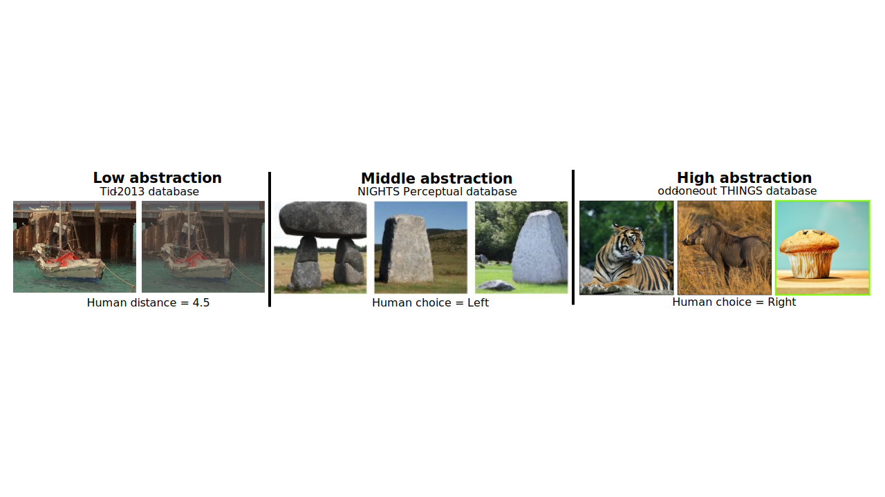

# Evaluating Human-CLIP Alignment at Different Abstraction Levels

Repository of the work Evaluating Human-CLIP Alignment at Different Abstraction Levels published on the first Re-Align Workshop at the 2024 ICLR.

We compute human alignment using three different abstraction levels at every model layer.

## Data of different abstractions

<p align="center">
    
</p>

Low abstraction: TID2013 database: same image.
Middle abstraction: NIGHTS perceptual: same class.
High abstraction: THINGS-odd-one-out: different class.

## Experiments

We analyze how different model configurations or training procedures affect the human alignment:

- Different distance measurements: Compare between plain Euclidean, cosine similarity and a normalized Euclidean (all features have unit mean over the dataset).

- Architecture: Compare between base-patch16, base-patch32, large-patch14, large-patch14-336. Base vs large have different number of layers; patchY divide the images into patches of Y x Y pixels; -336 model resize the images to 336x336 pixels instead of 224x244 and has more number of patches.

- Data nature: Compare between CLIP trained on natural images and CLIP trained on medical data.

- Last activation function: Compare between usual CLIP softmax activation function and SigLIP which replaces it with a sigmoid.

- Language: Compare between English vs Chinese trained CLIP.

## Citation

If you find it interesting and useful for your research and applications, please cite using this BibTeX:
```bibtex
@inproceedings{hernandezcamara_measuring,
title={Measuring Human-CLIP Alignment at Different Abstraction Levels},
author={Pablo Hern{\'a}ndez-C{\'a}mara and Jorge Vila-Tom{\'a}s and Jesus Malo and Valero Laparra},
booktitle={ICLR 2024 Workshop on Representational Alignment},
year={2024},
url={https://openreview.net/forum?id=xQyhHjLGmj}}
```
